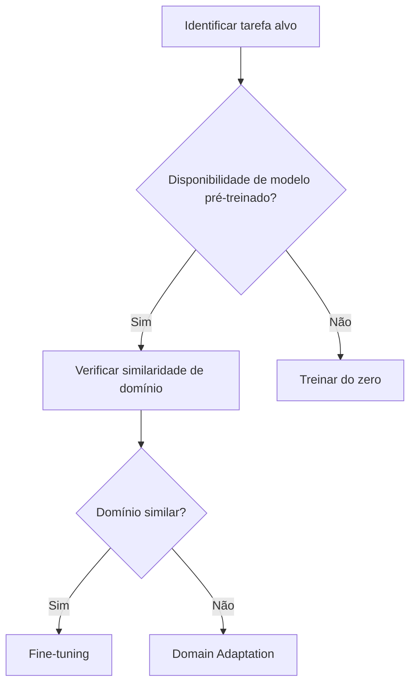

# Slides da Aula (Teoria – 1 h)

---
### Slide 1 – Título
**Transfer Learning – Conceitos Fundamentais**
- Reaproveitamento de conhecimento pré‑treinado
- Redução de tempo e dados necessários
- Aplicações em visão, NLP e dados tabulares
**Nota do apresentador:** Começar com uma pergunta motivadora: "Quem já treinou um modelo do zero? Quanto tempo levou?"

---
### Slide 2 – Motivação e Intuição
- Exemplo: Reconhecer gatos em fotos tiradas com câmeras diferentes
- Por que um modelo treinado em Dataset A pode falhar em Dataset B?
- **Nota:** Mostrar duas imagens (fonte vs alvo) e perguntar ao público.

---
### Slide 3 – Definição Formal
- **Domínio** $\mathcal{D}=\{\mathcal{X},P(X)\}$
- **Tarefa** $\mathcal{T}=\{\mathcal{Y},f(·)\}$
- **Transfer Learning**: usar $\mathcal{D}_S,\mathcal{T}_S$ para melhorar $\mathcal{D}_T,\mathcal{T}_T$
- **Nota:** Explicar a notação passo a passo antes de escrever a fórmula.

---
### Slide 4 – Taxonomia Básica
| Tipo | Característica | Exemplo |
|------|----------------|---------|
| Homogêneo | Mesmo tipo de dado | Imagens RGB → Imagens RGB |
| Heterogêneo | Dados diferentes | Texto → Imagens |
| Instance‑based | Re‑pesagem de amostras | k‑NN com fontes |
| Feature‑based | Representação compartilhada | CNN pré‑treinada |
| Model‑based | Ajuste de parâmetros | Fine‑tuning |
**Nota:** Apontar a linha que diferencia feature‑based de model‑based.

---
### Slide 5 – Comparação de Estratégias (TL, Treino do Zero, Fine‑tuning, Domain Adaptation)
| Estratégia | Treinamento do Zero | Fine‑tuning | Domain Adaptation |
|-----------|---------------------|------------|-------------------|
| Dados Necessários | Muitos | Poucos (últimas camadas) | Moderados + alinhamento |
| Complexidade | Alta | Média | Alta (adversarial) |
| Uso típico | Quando dados abundam | Quando há modelo pré‑treinado | Quando domínios têm distribuição distinta |
**Nota:** Destacar que todas podem ser vistas como “níveis” de TL.

---
### Slide 5b – Comparação Ampliada (inclui Domain Generalization e Meta‑learning)
| Estratégia | Treinamento do Zero | Fine‑tuning | Domain Adaptation | Domain Generalization | Meta‑learning |
|-----------|---------------------|------------|-------------------|----------------------|---------------|
| Dados Necessários | Muitos | Poucos | Moderados + alinhamento | Múltiplas fontes ou domínios | Pequenos conjuntos‑alvo (rápida adaptação) |
| Complexidade | Alta | Média | Alta (adversarial) | Alta (multi‑domínio) | Média‑Alta (algoritmos MAML) |
| Uso típico | Dados abundantes | Modelo pré‑treinado disponível | Domínios diferentes, mesma tarefa | Necessidade de robustez a novos domínios | Cenários de few‑shot / rapid adaptation |
**Nota:** Explicar que *Domain Generalization* visa generalizar sem acesso ao domínio alvo, enquanto *Meta‑learning* aprende a adaptar rapidamente.

---
### Slide 6 – Negative Transfer
- **Definição:** TL piora a performance no alvo.
- **Causas:** Domínio muito distante, rótulos incompatíveis, modelo fonte fraco.
- **Exemplo:** Modelos de dígitos MNIST aplicados a radiografias.
- **Detecção:** Avaliar performance no conjunto alvo antes de adotar TL.
**Nota:** Perguntar "Como saber se estamos sofrendo negative transfer?"

---
### Slide 7 – Quando usar TL? (Workflow Visual)

**Nota:** Explicar cada decisão em 1‑2 frases.

---
### Slide 8 – Resumo & Checklist
- TL ajuda quando há *similaridade* entre domínios.
- Evite TL se houver risco de *negative transfer*.
- Checklist rápido:
  1. Modelo pré‑treinado disponível?
  2. Domínio fonte ≈ domínio alvo?
  3. Dados alvo suficientes para fine‑tuning?
- **Nota:** Encerrar pedindo aos alunos que listem um caso de uso onde TL seria benéfico.

---
### Slide 9 – Referências
- Wang, J., & Chen, Y. (2023). *Introduction to Transfer Learning: Algorithms and Practice*. Springer.
- Outros recursos de apoio (artigos e tutoriais open‑source) sugeridos na página `docs/`.

---
*Todo o conteúdo está alinhado com Wang & Chen (2023) e reescrito em linguagem didática.*
