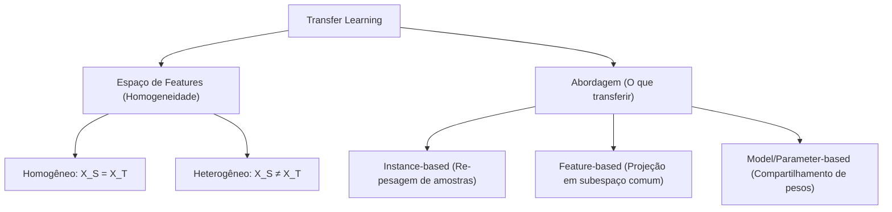

# Guia de Estudos: Aprendizado por Transferência (Transfer Learning)
**Engenharia de Produção / Ciência de Dados — PUC-Rio**

---

> [!NOTE]
> Este guia serve como material de apoio para a aula de **Transfer Learning**. Ele contém os fundamentos teóricos, formulação matemática baseada na literatura clássica e orientações práticas para a implementação de modelos de Deep Learning em cenários reais.

---

## 1. Introdução e Motivação

O paradigma tradicional do Aprendizado de Máquina (Machine Learning) assume uma premissa fundamental: **os dados de treino e os dados de teste pertencem ao mesmo espaço de features e são regidos pela mesma distribuição de probabilidade.** 

No entanto, em problemas reais de Ciência de Dados, essa suposição frequentemente falha por dois motivos principais:
1. **Escassez de Dados Rótulados:** Obter dados anotados suficientes para treinar grandes redes neurais profundas do zero (scratch) é caro, demorado e, em alguns domínios (como medicina ou controle de qualidade industrial), logisticamente inviável.
2. **Mudança de Distribuição (Covariate Shift):** Um modelo de detecção de defeitos em peças mecânicas treinado em uma fábrica A pode falhar na fábrica B devido a diferenças sutis de iluminação, ângulo da câmera ou desgaste físico da câmera, mesmo que as tarefas sejam idênticas.

O **Aprendizado por Transferência (Transfer Learning)** surge para resolver esses problemas, permitindo que um modelo aproveite o conhecimento adquirido em uma tarefa de origem (onde há abundância de dados) para melhorar a performance em uma tarefa de destino (onde os dados são escassos).

---

## 2. Definição Formal de Transfer Learning

Para entender a literatura científica, incluindo o livro-base de **Wang & Chen (2023)**, precisamos formalizar dois conceitos: **Domínio** e **Tarefa**.

### 2.1. Domínio ($\mathcal{D}$)
Um domínio $\mathcal{D}$ é composto por duas partes:
$$\mathcal{D} = \{\mathcal{X}, P(X)\}$$

Onde:
*   $\mathcal{X}$ é o **espaço de features** (ex: o conjunto de todas as possíveis matrizes de pixels de $224 \times 224$).
*   $P(X)$ é a **distribuição de probabilidade marginal** dos dados, onde $X = \{x_1, \dots, x_n\} \in \mathcal{X}$ representa as instâncias de dados individuais.

Se dois domínios diferem, significa que ou seus espaços de features são distintos ($\mathcal{X}_S \neq \mathcal{X}_T$) ou suas distribuições de probabilidade marginal divergem ($P(X_S) \neq P(X_T)$).

### 2.2. Tarefa ($\mathcal{T}$)
Dada uma descrição de domínio $\mathcal{D}$, uma tarefa $\mathcal{T}$ consiste em duas partes:
$$\mathcal{T} = \{\mathcal{Y}, f(\cdot)\}$$

Onde:
*   $\mathcal{Y}$ é o **espaço de labels** (ex: a classe "defeito" vs. "normal").
*   $f(\cdot)$ é a **função preditiva** (ou classificador) que queremos aprender a partir dos dados. Do ponto de vista probabilístico, $f(x)$ pode ser vista como a distribuição condicional $P(y|x)$ para uma instância $x$.

### 2.3. O Problema do Transfer Learning
Dados um domínio de origem (Source Domain) $\mathcal{D}_S$ com sua respectiva tarefa $\mathcal{T}_S$, e um domínio de destino (Target Domain) $\mathcal{D}_T$ com sua tarefa $\mathcal{T}_T$, o objetivo do Transfer Learning é ajudar a aprender a função preditiva alvo $f_T(\cdot)$ no domínio $\mathcal{D}_T$ utilizando o conhecimento extraído de $\mathcal{D}_S$ e $\mathcal{T}_S$.

A premissa básica é que **o domínio ou tarefa de origem é diferente do domínio ou tarefa de destino**:
$$\mathcal{D}_S \neq \mathcal{D}_T \quad \text{ou} \quad \mathcal{T}_S \neq \mathcal{T}_T$$

---

## 3. Taxonomia do Transfer Learning

A literatura categoriza o Transfer Learning de acordo com o relacionamento entre os domínios e as tarefas:



### 3.1. Classificação por Homogeneidade
*   **Transfer Learning Homogêneo:** Os espaços de features são iguais ($\mathcal{X}_S = \mathcal{X}_T$). A diferença está nas distribuições marginais de dados ($P(X_S) \neq P(X_T)$).
    *   *Exemplo:* Classificar imagens de satélite tiradas no verão (origem) vs. inverno (destino).
*   **Transfer Learning Heterogêneo:** Os espaços de features diferem ($\mathcal{X}_S \neq \mathcal{X}_T$).
    *   *Exemplo:* Transferir conhecimento de um dataset de texto (NLP) para classificação de imagens (Visão Computacional).

### 3.2. Classificação por Abordagem Algorítmica
1.  **Abordagem baseada em Instâncias (Instance-based):** Assume que partes dos dados de origem podem ser reaproveitadas no destino através de re-pesagem. Minimiza a divergência recalculando pesos para instâncias da origem que mais se parecem com as do destino.
2.  **Abordagem baseada em Features (Feature-based):** Projeta as features da origem e destino em um novo subespaço de features onde as distribuições das duas tarefas fiquem geometricamente próximas.
3.  **Abordagem baseada em Modelos/Parâmetros (Model/Parameter-based):** Assume que a tarefa de origem e a de destino compartilham parâmetros ou hiperparâmetros de seus modelos. É a técnica dominante em Visão Computacional moderna usando redes convolucionais (CNNs) pré-treinadas no ImageNet.

---

## 4. Prática de Visão Computacional: Duas Estratégias Principais

Quando aplicamos redes convolucionais pré-treinadas (como ResNet-18 ou ResNet-50) para tarefas de visão, subdividimos o Transfer Learning parametrizado em duas técnicas cruciais:

```
        REDE NEURAL CONVOLUCIONAL (Ex: ResNet)
      ┌───────────────────────────────────┬──────────────┐
      │  Camadas Convolucionais (Feature  │ Camada Linear│
      │        Extractor / Backbone)      │ Classif (FC) │
      └───────────────────────────────────┴──────────────┘
FE:          CONGELADO (Pesos ❄️)             TREINADO (🔥)
FT:         AJUSTE FINO (lr baixo 🔥)         TREINADO (🔥)
```

### 4.1. Extração de Features (Feature Extraction)
*   **Como funciona:** O "backbone" (camadas convolucionais responsáveis por detectar formas, bordas e texturas) é mantido congelado (`requires_grad = False`). Substituímos apenas a camada final totalmente conectada (Fully Connected - `fc`) por uma nova com o número de classes correspondente ao problema de destino. Apenas os parâmetros desta última camada são otimizados.
*   **Vantagens:** Extremamente rápido para treinar (poucos gradientes calculados), exige pouca memória RAM/GPU e é altamente resistente a *overfitting*.
*   **Quando usar:** Quando o dataset de destino é muito pequeno (ex: < 1.000 imagens) e muito similar ao dataset no qual o modelo foi originalmente treinado (ImageNet).

### 4.2. Ajuste Fino (Fine-tuning)
*   **Como funciona:** Inicializamos a rede com pesos pré-treinados, mas permitimos que as camadas convolucionais também tenham seus parâmetros modificados durante a retropropagação (`requires_grad = True`).
*   **Importante:** Usamos uma taxa de aprendizado (Learning Rate) **muito menor** (ex: `lr=0.001`) para o backbone do que usaríamos se treinássemos do zero. Isso evita destruir as representações genéricas robustas que o modelo já possui.
*   **Vantagens:** Pode atingir maior acurácia do que a extração de features, permitindo que a rede "especialize" seus filtros convolucionais finos aos novos padrões do dataset.
*   **Quando usar:** Quando temos um dataset de destino moderado/grande e a tarefa de destino é razoavelmente diferente da origem.

---

## 5. O Perigo do Aprendizado Negativo (Negative Transfer)

Um dos conceitos mais importantes abordados por **Wang & Chen (2023)** é o **Negative Transfer**. 

> [!WARNING]
> **Definição:** Ocorre quando a aplicação de Transfer Learning resulta em uma performance **pior** no domínio alvo do que se tivéssemos treinado um modelo simples do zero.

### Principais Causas:
1.  **Divergência Extrema de Domínio:** A tarefa de origem e destino têm características visuais completamente distintas. (Ex: Transferir conhecimento de um classificador de dígitos MNIST para classificar anomalias em radiografias pulmonares).
2.  **Incompatibilidade de Tarefa:** O relacionamento entre as classes de origem e de destino é contraditório.
3.  **Modelo Fonte Fraco (Weak Source Model):** O modelo pré-treinado de origem foi mal treinado ou sofre de subajuste (underfitting).

### Como Mitigar:
*   Calcular a similaridade entre os domínios antes de decidir transferir.
*   Utilizar algoritmos modernos de *Adversarial Domain Adaptation* para forçar o alinhamento das representações do modelo.

---

## 6. Resultados Práticos de Laboratório (Benchmark CIFAR-10)

Nos experimentos reais realizados na infraestrutura de laboratório em CPU utilizando um subset de **5.000 imagens de treino** (balanceadas com 500 por classe) extraídas do CIFAR-10, obtivemos os seguintes indicadores comparativos:

*   **Extração de Features (ResNet-18 Pré-treinada):** Estabilidade fantástica. Atingiu **74.5% de acurácia de validação** em apenas **13.1 minutos**.
*   **Treinamento do Zero (ResNet-18 Aleatória):** Desempenho crítico. Atingiu apenas **37.8% de acurácia de validação** e levou **25.9 minutos** (dobro do tempo). O comportamento das épocas finais mostrou flutuações e sinais latentes de overfitting devido à pequenez do dataset de treino.

### Discussão Acadêmica:
Esse teste prova empiricamente que tentar aprender 11 milhões de parâmetros de uma rede profunda com apenas 5.000 amostras gera um ajuste inadequado da rede. Por outro lado, focar o treinamento em apenas **5.130 parâmetros** da camada final (Feature Extraction) convergiu de maneira eficiente, demonstrando a robustez das features de baixo nível aprendidas previamente no ImageNet.

---

## 7. Checklist para Projetos Aplicados

Ao iniciar um projeto de visão computacional na Engenharia de Produção, utilize a matriz de decisão a seguir para definir a sua estratégia de Transfer Learning:

1.  **Tamanho do Dataset Target x Similaridade com ImageNet**

| | Muito Similar ao ImageNet | Muito Diferente do ImageNet |
| :--- | :--- | :--- |
| **Poucos Dados** (<1000 amostras) | **Feature Extraction** (Evita overfitting) | **Crítico.** Usar data augmentation agressivo ou modelos pré-treinados em domínios específicos. |
| **Muitos Dados** (>5000 amostras) | **Fine-tuning** (Acelera a convergência) | **Fine-tuning** (Inicia com pesos pré-treinados, mas adapta tudo) |

2.  **Otimização e Configuração:**
    *   No **Fine-tuning**, certifique-se de que a taxa de aprendizado é pequena ($10^{-3}$ ou $10^{-4}$).
    *   Sempre aplique as transformações e normalizações exatas do modelo de origem. A ResNet-18 exige redimensionar para $224\times224$ pixels e normalizar com a média `[0.485, 0.456, 0.406]` e desvio padrão `[0.229, 0.224, 0.225]`.

---

## 8. Guia de Sobrevivência & Depuração (PyTorch)

Ao implementar redes convolucionais profundas com PyTorch, é comum encontrar alguns problemas operacionais e lógicos. Abaixo estão os erros mais frequentes vivenciados por alunos e engenheiros, e como resolvê-los.

### 8.1. Travamento de Multiprocessamento no Windows
*   **Sintoma:** O programa trava no início do carregamento de dados, entra em um loop infinito abrindo dezenas de novos terminais/processos de Python ou consome 100% de CPU sem progresso.
*   **Causa:** O Windows não suporta o método de cópia de memória `fork` do Unix. Ele utiliza o método `spawn`, o que faz com que cada processo worker tente reexecutar todo o script desde o início.
*   **Solução:** 
    1. Sempre defina `num_workers = 0` nos `DataLoader` para executar de forma síncrona na thread principal durante o desenvolvimento ou demonstrações em Windows.
    2. Caso precise de multiprocessing, sempre envolva o ponto de entrada do seu script em:
       ```python
       if __name__ == '__main__':
           # Seu código principal aqui
       ```

### 8.2. Esquecimento do Modo de Avaliação (`model.eval()`)
*   **Sintoma:** O modelo apresenta excelente acurácia no treino, mas ao avaliar no dataset de validação, o desempenho cai dramaticamente ou varia aleatoriamente entre batches.
*   **Causa:** Algumas camadas, como `BatchNorm2d` e `Dropout`, comportam-se de formas opostas no treino e no teste. Sem `.eval()`, o `BatchNorm` continuará atualizando suas estatísticas móveis (média e variância) usando os dados do batch de validação (que costuma ser pequeno ou não-embaralhado), distorcendo as predições.
*   **Solução:** Sempre declare explicitamente a fase antes dos loops:
    ```python
    # Antes do loop de treino:
    model.train()

    # Antes do loop de validação/inferência:
    model.eval()
    ```

### 8.3. Erro de Incompatibilidade de Dimensão (Size Mismatch)
*   **Sintoma:** `RuntimeError: size mismatch for self, m1: [...], m2: [...]` no início da execução da camada totalmente conectada (`model.fc`).
*   **Causa:** Redes convolucionais como a ResNet-18 pré-treinadas no ImageNet esperam imagens de entrada de resolução $224 \times 224$ pixels. Imagens do CIFAR-10 são nativamente de tamanho $32 \times 32$. Se passadas sem redimensionar, o tensor de entrada chega menor do que o esperado na camada totalmente conectada final.
*   **Solução:** Aplique sempre o redimensionamento no pipeline de transformações do seu dataset:
    ```python
    transform = transforms.Compose([
        transforms.Resize(224), # Redimensiona 32x32 para 224x224
        transforms.ToTensor(),
        transforms.Normalize((0.485, 0.456, 0.406), (0.229, 0.224, 0.225))
    ])
    ```

### 8.4. Estouro de Memória do Sistema ou de Vídeo (OOM - Out of Memory)
*   **Sintoma:** O computador começa a travar após algumas épocas ou o PyTorch acusa `CUDA out of memory`.
*   **Causa:** Acúmulo do grafo de computação do autograd na memória RAM. Por exemplo, salvar a perda histórica fazendo `historico_loss.append(loss)` acumula todo o grafo do PyTorch de cada batch para sempre, impedindo o coletor de lixo de liberar a memória.
*   **Solução:**
    1. Use `.item()` para converter tensores de métricas em números nativos do Python:
       ```python
       # Incorreto: historico.append(loss)
       # Correto:
       historico.append(loss.item())
       ```
    2. Sempre envolva o loop de validação com o decorador de contexto do PyTorch para desativar o cálculo de gradiente:
       ```python
       with torch.no_grad():
           for inputs, labels in val_loader:
               outputs = model(inputs)
       ```
